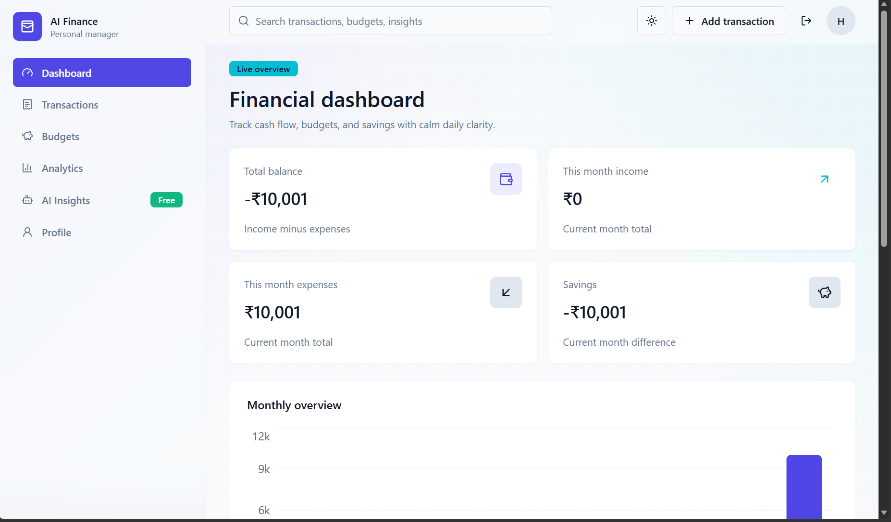

# AI-Powered Personal Finance Manager

Production-ready full-stack personal finance app with React, FastAPI, MongoDB Atlas, JWT authentication, budgeting, analytics, exports, and Gemini-powered insights.

## Tech Stack

- Frontend: React + Vite, Tailwind CSS, ShadCN-style UI, React Router, Axios, Recharts, Framer Motion, React Hook Form, Zod, Lucide icons
- Backend: FastAPI, Motor, MongoDB Atlas, JWT, bcrypt, Pydantic, python-dotenv, CORS
- Deployment: Netlify frontend, Render backend

## Project Structure

```text
backend/
  app/
    config/
    database/
    middleware/
    models/
    routes/
    schemas/
    services/
    utils/

frontend/
  src/
    components/
    context/
    ## Screenshots

    Add screenshots of the app to help users and contributors see the UI.

    Place image files in the `docs/images/` folder and reference them with relative paths so GitHub can display them. Example markdown:

    
    

    Recommendations:

    - Use PNG or JPG, optimized for web (1280×720 or 1024×600 works well).
    - Keep file names short and lowercase (e.g., `landing.png`, `dashboard.png`).

    How to add and push screenshots:

    ```bash
    mkdir -p docs/images
    git add docs/images/landing.png README.md
    git commit -m "docs: add screenshots to README"
    git push
    ```
    hooks/
    layouts/
    pages/
    services/
    utils/
```

## MongoDB Collections

`users`

- `name`
- `email` unique
- `password_hash`
- `created_at`
- `updated_at`

`transactions`

- `user_id`
- `title`
- `amount`
- `category`
- `type`: `income` or `expense`
- `date`
- `notes`
- `created_at`
- `updated_at`

`budgets`

- `user_id`
- `month`: `YYYY-MM`
- `category`
- `limit_amount`
- `alert_threshold`
- `created_at`
- `updated_at`

## Backend Setup

```bash
cd D:\codex\backend
python -m venv .venv
.venv\Scripts\activate
pip install -r requirements.txt
copy .env.example .env
```

Update `backend/.env`:

```env
MONGODB_URI=mongodb+srv://<username>:<password>@cluster0.xxxxx.mongodb.net/?retryWrites=true&w=majority
JWT_SECRET_KEY=a-long-random-secret
GEMINI_API_KEY=optional-gemini-api-key
```

Run:

```bash
uvicorn app.main:app --reload
```

Backend URL:

```text
http://127.0.0.1:8000
```

## Frontend Setup

```bash
cd D:\codex\frontend
npm install
copy .env.example .env
npm run dev
```

Frontend URL:

```text
http://127.0.0.1:5173
```

## API Routes

- `POST /api/v1/auth/signup`
- `POST /api/v1/auth/login`
- `GET /api/v1/auth/me`
- `POST /api/v1/auth/logout`
- `GET /api/v1/profile`
- `PATCH /api/v1/profile`
- `GET /api/v1/transactions`
- `POST /api/v1/transactions`
- `PUT /api/v1/transactions/{transaction_id}`
- `DELETE /api/v1/transactions/{transaction_id}`
- `GET /api/v1/budgets`
- `POST /api/v1/budgets`
- `PUT /api/v1/budgets/{budget_id}`
- `DELETE /api/v1/budgets/{budget_id}`
- `GET /api/v1/analytics/dashboard`
- `GET /api/v1/analytics/charts`
- `GET /api/v1/insights`

## Deployment

Frontend deploys with `netlify.toml` from the `frontend` folder.

Backend deploys with `render.yaml` from the `backend` folder. The backend must bind to Render's `PORT`, which is already handled by:

```bash
uvicorn app.main:app --host 0.0.0.0 --port ${PORT:-10000}
```

### Render backend

Use a free Render Web Service.

- Root directory: `backend`
- Build command: `pip install -r requirements.txt`
- Start command: `uvicorn app.main:app --host 0.0.0.0 --port ${PORT:-10000}`
- Python version: `3.12.4`

Set these Render environment variables. Do not wrap values in quotes in the Render dashboard.

- `PYTHON_VERSION=3.12.4`
- `ENVIRONMENT=production`
- `DEBUG=false`
- `MONGODB_URI=mongodb+srv://<username>:<password>@cluster0.xxxxx.mongodb.net/?retryWrites=true&w=majority`
- `MONGODB_DB_NAME=finance_manager`
- `MONGODB_SERVER_SELECTION_TIMEOUT_MS=10000`
- `MONGODB_TLS_ALLOW_INVALID_CERTS=false`
- `JWT_SECRET_KEY=<long-random-secret>`
- `JWT_ALGORITHM=HS256`
- `JWT_ACCESS_TOKEN_EXPIRE_MINUTES=1440`
- `GEMINI_API_KEY=<optional>`
- `GEMINI_MODEL=gemini-2.0-flash`
- `CORS_ORIGINS=https://your-netlify-site.netlify.app`
- `CORS_ORIGIN_REGEX=^https://.*\.netlify\.app$`

In MongoDB Atlas, open Network Access and allow the Render service to connect. For the simplest free setup, use `0.0.0.0/0` while keeping a strong database username and password. If you later move to a host with static outbound IPs, replace it with only those IPs.

Verify Render after deploy:

```bash
curl https://your-render-service.onrender.com/api/v1/health
curl https://your-render-service.onrender.com/api/v1/health/database
```

The database endpoint should return `"configured": true` and `"connected": true`.

### Netlify frontend

Use a free Netlify site.

- Base directory: `frontend`
- Build command: `npm run build`
- Publish directory: `frontend/dist` if configuring from the repo root, or `dist` if Netlify reads `netlify.toml`

Set this Netlify environment variable:

- `VITE_API_BASE_URL=https://your-render-service.onrender.com/api/v1`

Redeploy Netlify after setting it, because Vite reads `VITE_*` variables at build time.

## Verification

```bash
cd D:\codex\backend
python -m compileall app

cd D:\codex\frontend
npm run lint
npm run build
```
